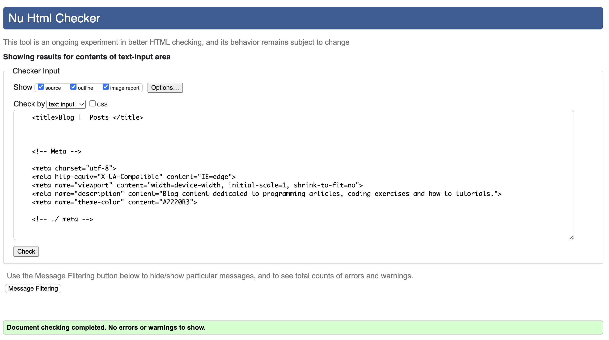
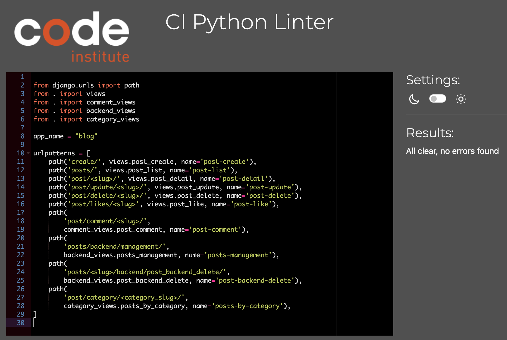
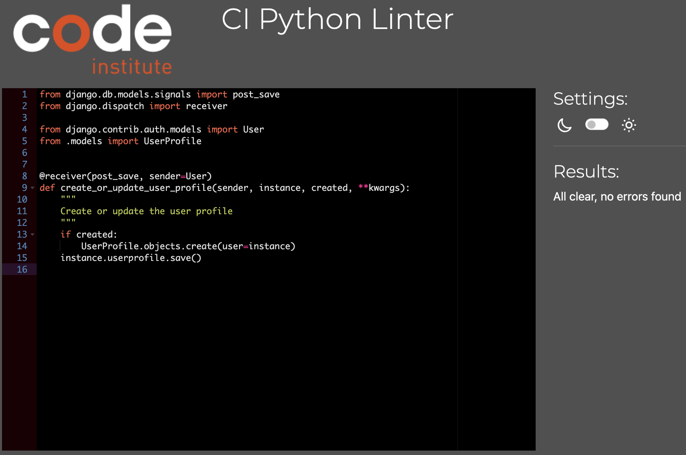
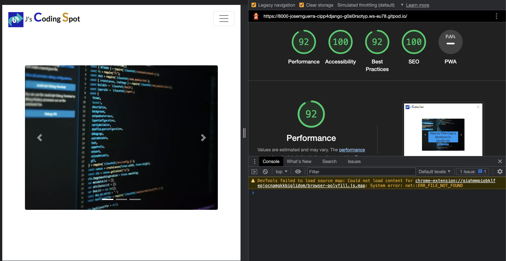

## Html checker

- 

  
Blog homepage

  - 
  - 

  

- 

  
Blog posts

  - 
  - 
  
  

- 

  
Blog post detail

  - 
  - 

  

- 

  
Blog user profile 

  - 
  - 

  

- 

  
Blog posts management 

  - 
  - 

  

## CSS validator

- 

  
CSS validator 

  - 
  
  

## CI PEP8 linter

- 

  
Settings urlpatterns linter

  - 
  
  

- 

  
Settings linter

  - 
  
  

- 

  
Blog views linter

  - 
  
  

- 

  
Blog model linter

  - 
  
  

- 

  
Blog forms linter

  - 
  
  

- 

  
Blog admin linter

  - 
  
  

- 

  
Blog urls linter

  - 
  
  

- 

  
Category views linter

  - 
  
  

- 

  
Comment views linter

  - 
  
  

- 

  
Home views linter

  - 
  
  

- 

  
Profiles views linter

  - 
  
  

- 

  
Profiles signals linter

  - 
  
  

- 

  
Backend views linter

  - 
  
  

## Lighthouse testing

- 

  
Homepage lighthouse test

  - 
  
  

- 

  
Posts lighthouse test

  - 
  
  

- 

  
Post detail lighthouse test

  - 
  
  

- 

  
Posts management lighthouse test

  - 
  
  

- 

  
Profile page lighthouse test

  - 
  
  

## Contrast checker

- 

  
Contrast checker

  - 
  - 
  
  

## Manual testing

- 

  
Registration manual testing

  - 
  
  

- 

  
Login / logout manual testing

  - 
  
  

- 

  
Homepage unregistered user manual testing

  - 
  
  

- 

  
Posts / post detail unregistered user manual testing

  - 
  
  

- 

  
Registered user topnav manual testing

  - 
  
  

- 

  
Registered user profile manual testing

  - 
  
  

- 

  
Registered user add post manual testing

  - 
  
  

- 

  
Registered user post detail manual testing

  - 
  
  

- 

  
Registered user contact form manual testing

  - 
  
  

- 

  
Footer manual testing

  - 
  
  

- 

  
Admin / Staff post management manual testing

  - 
  
  

